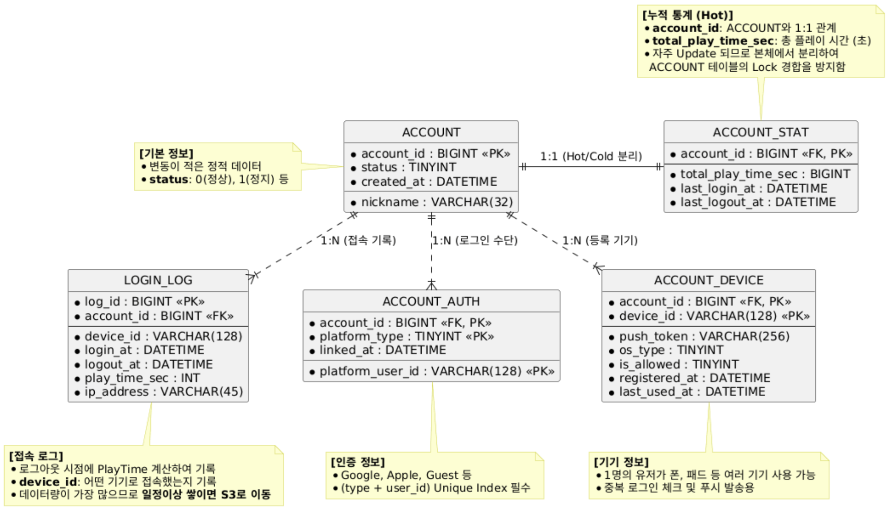
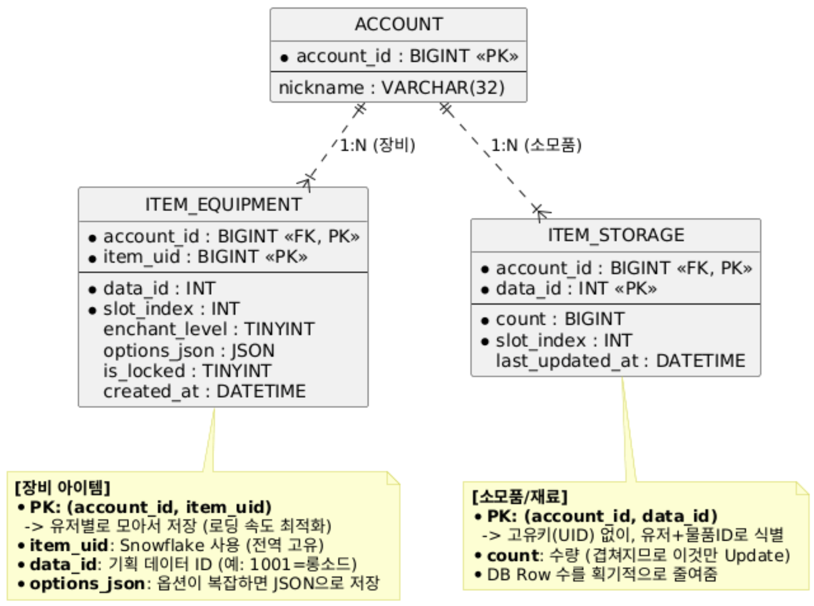

# MMO-Server-Boilerplate 🚀

 
 
 

**Hybrid Game Server Architecture** combining the raw speed of **IOCP** with the scalability of **NATS**.

> 🚧 **Note:** This project is currently in the **initial development phase**. The architecture design and base structure are being established.
> (현재 프로젝트 초기 구조 설계 및 보일러플레이트 작성 단계입니다.)

> **Project Goal:** 실시간 이동 동기화(Movement Sync) 및 대규모 트래픽 처리를 위한 확장 가능한 게임 서버 아키텍처 구현.  
> **Target:** 단일 인스턴스 기준 **CCU 1,000명**의 이동 동기화 및 DB 트랜잭션 처리 안정성 검증.

---

## 🏗 Architecture Design (Planned)

이 프로젝트는 **Legacy의 고성능**과 **Modern의 유연함**을 결합한 하이브리드 아키텍처를 지향합니다.

* **Gateway / Game Server (C# IOCP):** 클라이언트와의 직접적인 TCP 연결 관리, 패킷 직렬화, 게임 로직(이동, 전투) 처리.
* **Message Broker (NATS):** 게임 서버와 DB 워커 간의 느슨한 결합(Decoupling) 및 비동기 메시지 처리를 담당.
* **DB Worker:** NATS 큐를 구독하며 실제 데이터 처리. 부하 발생 시 독립적인 스케일 아웃 가능.
* **Infrastructure (Testcontainers):** 개발 및 테스트 환경에서 Docker를 통해 NATS와 MySQL을 동적으로 프로비저닝.

---

## 🗺 Implementation Roadmap & Status

### 1. Hybrid Communication Pattern
- [ ] **Direct TCP (IOCP) Engine:** `System.Net.Sockets` 기반의 비동기 네트워크 엔진 구현.
- [ ] **Packet Serialization:** 리플렉션을 사용하지 않는 고성능 패킷 직렬화/역직렬화 버퍼 처리.
- [ ] **NATS Integration:** `Request-Reply` 패턴을 통한 DB 비동기 처리 연동.

### 2. Hot/Cold Data Separation Strategy
데이터베이스의 Lock 경합을 최소화하기 위해 데이터의 성격에 따라 테이블을 분리 설계했습니다.

### 3. Development Environment
- [x] **Project Structure:** 솔루션 및 프로젝트 분리 (`GameServer`, `DBServer`, `TestRunner`).
- [ ] **Testcontainers Setup:** NATS, MySQL 동적 프로비저닝 및 `TestRunner` 연동.
- [ ] **Integrated Debugging:** 다중 서버 프로세스 통합 디버깅 환경 구축.

---

## 🛠 Target Tech Stack

| Category | Technology | Description |
| :--- | :--- | :--- |
| **Language** | C# 14 (.NET 10.0) | Latest functional features & performance |
| **Network** | System.Net.Sockets | Custom IOCP Network Engine |
| **Messaging** | NATS.Net (v2) | High-performance Pub/Sub & Request-Reply |
| **Database** | MySQL 8.0 | RDBMS with Hot/Cold Partitioning |
| **Testing** | Testcontainers | Infrastructure as Code for Testing |
| **Logging** | Serilog | Structured Logging |

---

## 🚀 Getting Started (Planned)

### Prerequisites
* Windows 10/11 or macOS
* **Docker Desktop** (Must be running)
* .NET 10.0 SDK
* IDE (JetBrains Rider or Visual Studio 2022)

### Installation & Run
*(작업 진행 후 업데이트 예정)*
1.  Clone the repository.
2.  Open `MMO-Server-Boilerplate.sln`.
3.  Set `TestRunner` as StartUp Project and Press **F5**.

---

## 👤 Author

**Kang Ik-jun** (Server Programmer)
* Experience with C++ & C# Game Server Development.
* Interested in High-Performance Network Architecture & Cloud Native Gaming.